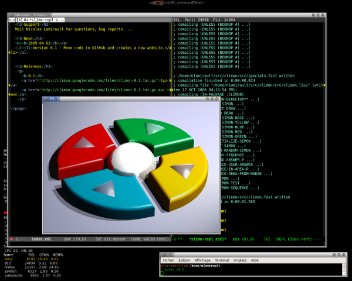

Climon
======

This is the classic [Simon](http://en.wikipedia.org/wiki/Simon_(game)) game in Common Lisp.

## Required softwares

You will need :

* [SBCL](http://www.sbcl.org)
* [Quicklisp](http://www.quicklisp.org)

and dependencies :

    $ sudo apt-get install libsdl1.2-dev libsdl-image1.2-dev libsdl-mixer1.2-dev

## Installation

    CL-USER> (ql:quickload "climon")

## Launch game

In a lisp REPL :

    CL-USER> (climon:climon)

or using bash:

    $ ./climon.sh

## Commands

Available commands :

* space : Start a new game
* mouse : click to the specific color
* g : choose GREEN
* b : choose BLUE
* y : choose YELLOW
* r : choose RED

## Screenshots

## Development

* Install [roswell][] to setup the Common Lisp environment and install your Common Lisp implementation using it.:

        $ make init
        $ ros install sbcl

* Install dependencies :

        $ make deps

* Launch unit tests :

        $ make test

## Changelog

A changelog is available [here](ChangeLog.md).

## Contact

Nicolas Lamirault <nicolas.lamirault@gmail.com>
